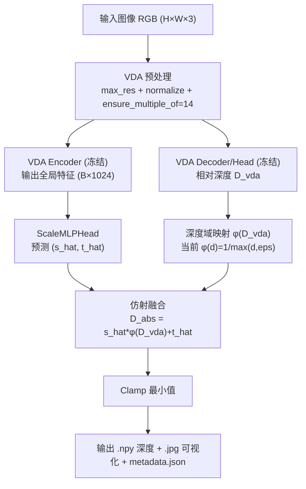

# Agent_VDA_Absolute_Distillation-CN

## 1. 算法目标与定位

本库的目标是把 **Video Depth Anything (VDA)** 从“视频相对深度估计器”改造成“单图可用的绝对深度估计器（伪绝对）”：

- 保留 VDA 的结构细节与边缘质量（学生网络主干冻结）。
- 使用 Depth Pro 输出作为教师深度，离线拟合每帧尺度参数。
- 学习一个轻量 `ScaleMLPHead`，从 VDA 全局特征预测 `(s, t)`。
- 推理时使用  
  `D_abs = s_hat * phi(D_vda) + t_hat`，  
  其中当前默认 `phi(d)=1/max(d, eps)`（`reciprocal_linear`）。

该方案本质是：**预训练视觉表征 + 场景尺度映射**，不是端到端重建真实物理深度的严格标定系统。

## 2. 入口文件（按阶段）

- 空间对齐：`VDA_Absolute_Distillation/data_prep/01_spatial_align.py`
- 伪标签提取：`VDA_Absolute_Distillation/data_prep/02_extract_scale_labels.py`
- 数据集封装：`VDA_Absolute_Distillation/core_engine/dataset.py`
- 训练主程序：`VDA_Absolute_Distillation/core_engine/train_distill.py`
- 单图推理：`VDA_Absolute_Distillation/inference_abs_vda.py`
- VDA 单图封装：`VDA_Absolute_Distillation/models/modified_vda.py`
- 尺度头：`VDA_Absolute_Distillation/models/scale_mlp_head.py`
- 主配置：`VDA_Absolute_Distillation/configs/distill_config.yaml`

## 3. 输入输出定义（含形状及变化）

### 3.1 `01_spatial_align.py`

输入：
- `raw_vda_depth/camXX/*.npy`，典型形状 `960 x 1280`（float32）
- `raw_depth_pro_depth/camXX/*.npz['depth']`，典型形状 `1014 x 1352`（float32）

处理：
- 双线性插值：`D_vda(960x1280) -> D_vda_aligned(1014x1352)`

输出：
- `aligned_vda_root/camXX/*.npy`
- `aligned_vda_root/manifest.json`

### 3.2 `02_extract_scale_labels.py`

输入：
- 图像路径：`images/camXX/*.jpg`
- VDA 深度：`.npy`
- Depth Pro 深度：`.npz['depth']`

处理（每帧）：
- `vda_up = resize(vda_depth, depth_pro_shape)`
- `vda_mapped = phi(vda_up)`，当前默认 `phi(d)=1/max(d, eps)`
- 闭式最小二乘求 `(s*, t*)`：
  `argmin_{s,t} || s*vda_mapped + t - depth_pro ||^2`

输出：
- `labels/scale_labels.json`
- `labels/scale_labels.csv`

单条样本字段（核心）：
- `camera`, `frame_id`, `image_path`
- `vda_shape`, `depth_pro_shape`
- `depth_mapping_mode`
- `scale`, `shift`, `residual_mse`, `valid_pixels`

### 3.3 `modified_vda.py`（训练/推理公用）

输入：
- 单张或多张 RGB 图像，原始形状 `H x W x 3`

处理链：
- `max_res` 约束长边（默认 1280）
- `Resize + Normalize + PrepareForNet`，且 `ensure_multiple_of=14`
- 批量时做 **padding 到 batch 内最大高宽**（已支持不同分辨率样本同批次）

关键输出：
- `extract_global_features`：`B x 1024`
- `predict_relative_depth`：`B x H' x W'`（网络输入分辨率）
- `infer_single_image.relative_depth`：回采样到当前图像处理后尺寸 `H_r x W_r`

### 3.4 `train_distill.py`

输入：
- `labels_json` 中的样本（含 `image_path`, `scale`, `shift`）

训练目标：
- 模型输入：`feature(B,1024)`
- 模型输出：`pred(B,2) -> [s_hat, t_hat]`
- 损失：`lambda_s*MSE(s_hat,s*) + lambda_t*MSE(t_hat,t*)`

输出：
- `runs/<run_name>/last.pt`
- `runs/<run_name>/best.pt`
- `runs/<run_name>/history.json`

### 3.5 `inference_abs_vda.py`

输入：
- `--input`：单图或目录
- `--checkpoint`：训练得到的 `best.pt/last.pt`
- `--config`

处理（每帧）：
- `D_vda <- SingleImageVDA.infer_single_image`
- `(s_hat,t_hat) <- ScaleMLPHead(global_feature)`
- `D_abs = s_hat * phi(D_vda) + t_hat`
- `D_abs = max(D_abs, clamp_min_depth)`

输出：
- `output_dir/*.npy`（绝对深度）
- `output_dir/*.jpg`（可视化）
- `output_dir/metadata.json`

## 4. 核心数据流（训练与推理）

训练链路：
- `RGB + raw_vda_depth + raw_depth_pro_depth`
- `标签提取`：生成 `(s*, t*)`
- `ScaleLabelDataset` 加载样本
- `冻结 VDA -> 抽全局特征`
- `ScaleMLPHead 回归 (s_hat,t_hat)`
- `保存 best/last`

推理链路：
- `RGB`
- `VDA 单图相对深度 + 全局特征`
- `ScaleMLPHead 预测 (s_hat,t_hat)`
- `reciprocal + 线性仿射`
- `输出 D_abs`

## 5. 训练目标与学习性质

- 离线拟合是线性的（闭式最小二乘）。
- 尺度头是非线性的（MLP）。
- 深度映射是线性的仿射（对 `phi(D_vda)` 做一阶变换）。

因此整体是：**非线性预测参数 + 线性深度变换**。

## 6. 关键约束与边界条件

- 必须冻结 VDA backbone 与 decoder/head（蒸馏只训练尺度头）。
- 输入预处理必须保持 VDA 原规范（均值方差、`ensure_multiple_of=14`）。
- 深度读取格式固定：VDA `.npy`，Depth Pro `.npz['depth']`。
- `depth_mapping.reciprocal_eps` 必须 `>0`。
- 分辨率拟合前必须对齐到教师分辨率（双线性）。
- 配置中可设置黑名单相机（如 `cam02`）强制跳过。
- 当前训练集/验证集为帧级随机切分，不能直接等价跨场景泛化。

## 7. 参数配置及意义（`distill_config.yaml`）

| 参数 | 默认值 | 作用 | 影响 |
|---|---:|---|---|
| `preprocess.input_size` | 518 | 目标输入基准尺寸 | 影响感受野、速度、显存 |
| `preprocess.max_res` | 1280 | 长边上限 | 限制显存，改变有效分辨率 |
| `preprocess.ensure_multiple_of` | 14 | ViT patch 对齐 | 不满足会破坏编码器对齐 |
| `model.encoder` | vitl | VDA 编码器规模 | 精度/速度权衡 |
| `scale_head.hidden_dims` | [512,128] | 尺度头容量 | 过小欠拟合，过大易过拟合 |
| `depth_mapping.mode` | reciprocal_linear | 深度域映射方式 | 决定拟合物理假设 |
| `depth_mapping.reciprocal_eps` | 1e-6 | 倒数稳定项 | 防止除零/数值爆炸 |
| `train.batch_size` | 4 | 每步样本数 | 速度与显存平衡；现已支持变分辨率 padding |
| `train.learning_rate` | 1e-4 | 优化步长 | 收敛速度与稳定性 |
| `train.weight_decay` | 1e-5 | 正则化 | 控制尺度头过拟合 |
| `train.lambda_s/lambda_t` | 1/1 | 两任务损失权重 | 决定 scale 与 shift 学习侧重 |
| `train.train_split` | 0.8 | 训练验证划分 | 指标波动与泛化评估偏差 |
| `inference.clamp_min_depth` | 0 | 最小深度截断 | 保证输出非负 |

## 8. 注意问题（当前最需要盯住）

- 教师噪声：Depth Pro 不是激光真值，误差会传递到学生。
- 泛化风险：场景内随机切分容易高估能力。
- 物理一致性：`reciprocal + 仿射`是工程折中，不等于严格几何标定。
- 数值稳定性：`phi(d)=1/d` 在小深度值处敏感，`eps` 不可随意改小。
- 分辨率链路：任一 resize/padding 策略变更都可能改变 `(s,t)` 分布。
- 批处理 padding：已解决 shape 冲突，但黑边比例变化可能影响特征统计。

## 9. 输入到推理结果流程图

## 10. 一句话结论

当前库已经形成可运行闭环：**离线伪标签 -> 冻结特征蒸馏 -> 单图绝对深度推理**；其优势在场景内尺度稳定化，主要短板是跨场景泛化与严格物理一致性仍待系统验证。
